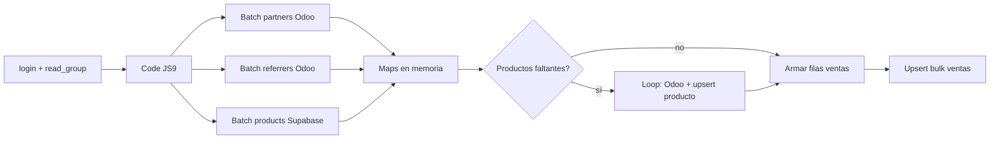

# Real Import Productos (Optimized)

Copia optimizada del workflow n8n **Real Import Productos**, sin modificar el original.

| Workflow | ID | Estado |
|----------|-----|--------|
| **Real Import Productos** (original) | `ux5h4tbSHE6SfRXA` | Sin cambios |
| **Real Import Productos (Optimized)** | `6QBAVjroEr0o3Gqv` | Inactivo (probar antes de activar) |

URL optimizado: https://n8n.srv908725.hstgr.cloud/workflow/6QBAVjroEr0o3Gqv

## Qué se mantiene igual

- Schedule → login Odoo → `read_group` en `account.invoice.report` (mismos filtros, campos y parámetros)
- Nodo **Code in JavaScript9** (filtro, normalización y orden)
- Nodos de resumen **Code in JavaScript8** / **Code in JavaScript10**
- Credenciales **P&L** (Supabase) y **Conexion Alfonso Produccion** (Odoo)
- Campos escritos en `products` y `ventas`
- Lógica: si el producto no está en Supabase, se busca en Odoo y se crea antes de cargar ventas

## Flujo optimizado



### Requests por ejecución (aprox.)

| Paso | Calls |
|------|-------|
| Login + ventas Odoo | 2 |
| Partners + referrers Odoo | 2 |
| Productos Supabase (`or` id_odoo + name) | 1 |
| Loop productos “faltantes” | Por ítem: si existe por **name/alias** → `PATCH` solo `id_odoo`. Si no existe → Odoo + **INSERT** nuevo (con category). Si tras Odoo matchea por nombre → `PATCH` solo `id_odoo` (nunca pisa name/alias/category) |
| Patch `id_odoo` en productos encontrados por nombre | 0–1 |
| Ventas Supabase bulk upsert | 1 |

Con catálogo completo, **M ≈ 0** → ~6 requests fijos + 1 bulk de ventas (vs ~3×N en el original).

## Archivos en el repo

- `exports/n8n-real-import-productos-original.json` — export del workflow original (referencia)
- `exports/n8n-real-import-productos-optimized.json` — definición de la copia optimizada
- `scripts/build-n8n-real-import-optimized.mjs` — regenerar / volver a subir la copia

```bash
node scripts/build-n8n-real-import-optimized.mjs
```

Requiere `N8N_API_KEY` o `.cursor/mcp.json` con la clave de la API n8n.

## Prueba recomendada

1. Dejar **inactivo** el optimizado y el original como está.
2. En n8n, abrir **Real Import Productos (Optimized)** y ejecutar manualmente con un rango de fechas acotado (ajustar fechas en **HTTP Request3** si hace falta).
3. Comparar totales por empresa con **Code in JavaScript8/10** y con ventas en Supabase.
4. Si coincide, desactivar el original y activar el optimizado (o renombrar).

## Upsert de ventas

El nodo **HTTP Bulk Upsert Ventas** usa:

```
POST /rest/v1/ventas?on_conflict=company,fecha,move_id,id_producto,partner
Prefer: resolution=merge-duplicates
```

Índice en DB: `ventas_upsert_key` (migración `20260604140000_ventas_upsert_unique_key.sql`).

## Regenerar sin tocar el original

El script solo hace `POST /workflows` (workflow nuevo). Para actualizar la copia existente habría que usar `PUT` con el id `6QBAVjroEr0o3Gqv` (extender el script si lo necesitás).
