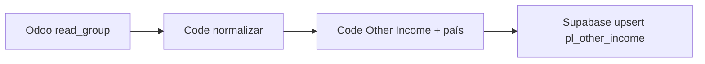

# Other Income (P&L)

Línea **Other Income** entre **Total Cost of Sales** y **Gross Profit**.

## Fórmula

`Gross Profit = Sales Revenue − Total Cost of Sales + Other Income`

## Tabla `pl_other_income`

| Campo | Descripción |
|-------|-------------|
| `year`, `month` | Período |
| `country_code` | País (UY, AR, …) |
| `modelo` | `real` o `budget` |
| `account_name` | Nombre de la cuenta contable (libre) |
| `amount_usd` | Monto del mes |

**Clave única:** `(year, country_code, month, modelo, account_name)`

## Uso en la app

1. P&L → expandir **Other Income** (chevron).
2. **Agregar cuenta** → nombre de la cuenta.
3. **Doble clic** en un mes para cargar el monto (requiere **un solo país** seleccionado, como impuestos/SG&A país).

Con varios países en el filtro se **suman** las cuentas de todos para mostrar totales; la edición solo con un país.

---

## Carga desde n8n (nodo Supabase)

### Credencial

Usá la **`service_role`** de Supabase (Settings → API), **no** la `anon`. El service role evita RLS y es el mismo patrón que otras cargas server/n8n del proyecto.

En n8n: credencial **Supabase** con URL del proyecto + service role key.

### Tabla y upsert

| Campo | Tipo | Ejemplo |
|-------|------|---------|
| `year` | int | `2026` |
| `month` | int 1–12 | `5` |
| `country_code` | text | `AR` (no el nombre de la LLC) |
| `modelo` | text | `real` o `budget` |
| `account_name` | text | Nombre visible en P&L (ej. cuenta Odoo) |
| `amount_usd` | numeric | Monto del mes en USD (**positivo** = ingreso) |

**Clave única (conflict):** `year`, `country_code`, `month`, `modelo`, `account_name`

Una fila por **mes + país + modelo + cuenta**. Re-ejecutar el workflow actualiza el mismo mes (upsert), no duplica.

### Nodo Supabase en n8n (recomendado)

1. **Resource:** Row  
2. **Operation:** Create (o *Insert* / *Upsert* según versión del nodo) con **Upsert** activado si existe la opción  
3. **Table:** `pl_other_income`  
4. **On conflict / Duplicate handling:** columnas  
   `year,country_code,month,modelo,account_name`  
5. **Fields** (mapear desde el ítem anterior):

   - `year` → `{{ $json.year }}`
   - `month` → `{{ $json.month }}`
   - `country_code` → `{{ $json.country_code }}`
   - `modelo` → `real` (fijo) o `{{ $json.modelo }}`
   - `account_name` → `{{ $json.account_name }}`
   - `amount_usd` → `{{ $json.amount_usd }}`

6. Ejecutá el nodo **una vez por ítem** (modo “Run once for each item”) si el nodo anterior devuelve varias filas.

Si tu nodo no tiene upsert claro, usá **HTTP Request** (abajo).

### HTTP Request (alternativa REST)

```
POST https://<PROJECT_REF>.supabase.co/rest/v1/pl_other_income
```

Headers:

| Header | Valor |
|--------|--------|
| `apikey` | `<SERVICE_ROLE_KEY>` |
| `Authorization` | `Bearer <SERVICE_ROLE_KEY>` |
| `Content-Type` | `application/json` |
| `Prefer` | `resolution=merge-duplicates` |

Body (un objeto o array de objetos):

```json
{
  "year": 2026,
  "month": 1,
  "country_code": "AR",
  "modelo": "real",
  "account_name": "Intereses ganados",
  "amount_usd": 1250.5
}
```

Query opcional en la URL para indicar conflicto:

`?on_conflict=year,country_code,month,modelo,account_name`

### Mapeo compañía Odoo → `country_code`

El P&L filtra por **país**, no por nombre de LLC. Desde el campo `company` de Odoo:

| Compañía (ventas / Odoo) | `country_code` |
|--------------------------|----------------|
| SouthGenetics LLC | UY |
| SouthGenetics LLC Uruguay | UY |
| SouthGenetics LLC Argentina / Arge | AR |
| Southgenetics LLC Chile | CL |
| SouthGenetics LLC Colombia | CO |
| SouthGenetics LLC México | MX |
| SouthGenetics LLC Venezuela | VE |

### Nodo Code — preparar filas para Supabase

Después del normalizador Odoo ([`n8n-odoo-company-costs-code.md`](./n8n-odoo-company-costs-code.md)), filtrá solo cuentas que son **Other Income** (lista propia; no son las líneas COS de `pl_company_monthly_cos`).

```javascript
const COMPANY_TO_COUNTRY = {
  "SouthGenetics LLC": "UY",
  "SouthGenetics LLC Uruguay": "UY",
  "SouthGenetics LLC Argentina": "AR",
  "SouthGenetics LLC Arge": "AR",
  "Southgenetics LLC Chile": "CL",
  "SouthGenetics LLC Colombia": "CO",
  "SouthGenetics LLC México": "MX",
  "SouthGenetics LLC Venezuela": "VE",
};

// Ajustá: nombres de cuenta Odoo (o IDs) que van a Other Income
const OTHER_INCOME_ACCOUNT_PATTERNS = [
  /interes/i,
  /other income/i,
  /otros ingresos/i,
  // agregar según plan de cuentas
];

function isOtherIncomeAccount(accountLabel) {
  const s = String(accountLabel || "");
  return OTHER_INCOME_ACCOUNT_PATTERNS.some((re) => re.test(s));
}

const modelo = "real"; // o "budget"
const items = $input.all();

const out = [];
for (const item of items) {
  const j = item.json;
  if (!j.year || !j.month || !j.company || !j.account) continue;
  if (!isOtherIncomeAccount(j.account)) continue;

  const country_code = COMPANY_TO_COUNTRY[String(j.company).trim()];
  if (!country_code) continue;

  // Odoo suele traer gastos positivos; ingresos a veces vienen negativos.
  // En P&L Other Income debe guardarse como positivo si es ingreso.
  const raw = Number(j.balance ?? 0);
  const amount_usd = Math.abs(raw); // o -raw si tu convención Odoo es al revés

  out.push({
    json: {
      year: j.year,
      month: j.month,
      country_code,
      modelo,
      account_name: String(j.account).trim(),
      amount_usd,
    },
  });
}

return out;
```

Si el mismo mes/cuenta/país viene en varias filas, agregá un nodo **Aggregate** (o sumá en Code) antes del upsert.

### Flujo sugerido en n8n



1. Odoo: saldos por mes, compañía y cuenta.  
2. Code: mismo formato que COS (`year`, `month`, `company`, `account`, `balance`).  
3. Code: filtrar cuentas Other Income + `country_code`.  
4. Supabase: upsert a `pl_other_income`.

### Comprobar en la app

P&L → Real → **un país** (ej. Argentina) → expandir **Other Income**. Deberían aparecer las cuentas con los montos cargados.

### Errores frecuentes

| Problema | Causa |
|----------|--------|
| No aparece nada en P&L | `country_code` mal mapeado, `modelo` distinto al de la vista (Real vs Budget), o país del filtro no coincide |
| Cuenta duplicada | Mismo `account_name` con distinto spelling; unificar nombre en n8n |
| Monto con signo invertido | Ajustar `amount_usd` en Code (`Math.abs` vs `-balance`) según Odoo |
| 401 / RLS | Credencial sin **service_role** |
| Violación unique | Upsert sin `on_conflict`; usar merge-duplicates o upsert del nodo |
